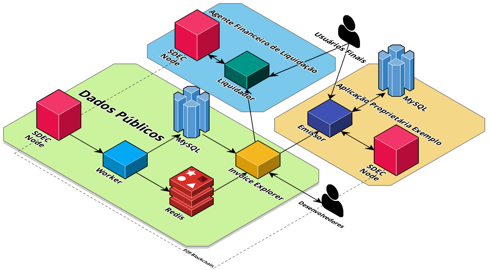
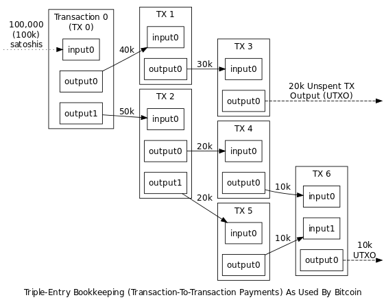

# Introdução

*SDEC: Sistema Distribuído de Emissão de Contribuição*

O Sistema Distribuído de Emissão de Contribuição (SDEC), é um sistema no qual as notas fiscais de serviços serão gerenciadas e emitidas a partir de um sistema descentralizado e nacional, racionalizando a dinâmica dos atuais sistemas existentes, assim como aumentando a eficiência na arrecadação.

O objetivo central do sistema é mudar a dinâmica existente atualmente na emissão de notas fiscais de serviços ao redor do país e aproveitar a estrutura existente, porém dando uma nova função a ela.

Enquanto no modelo atual cada município é o responsável pela arrecadação do Imposto Sobre Serviços de Qualquer Natureza, incorrendo em toda a estrutura necessária para tal feito, muitas cidades, por não possuírem arrecadação suficiente que justifique tal investimento, acabam por deixarem de possuir uma potencial fonte de renda a mais advinda da cobrança de tal imposto.

Mas não somente as cidades perdem com isto, as empresas, obrigadas a cumprir com as regras tributárias, acabam por dispender muito recurso para conseguir se enquadrarem adequadamente e, mesmo assim, muitas vezes não o conseguem, acarretando, além de uma perda de produtividade na cadeia produtiva, uma perda na arrecadação das cidades.

## Órgãos da Rede

No modelo atual de arrecadação do ISS, cada cidade apresenta sua estrutura para arrecadação do imposto, o que acaba gerando uma falta de padrão entre órgãos e processos a mais para os empreendedores.

Na maioria das cidades brasileiras, o município deixa a responsabilidade da arrecadação para a secretaria da fazenda, é nela que o empreendedor deve se cadastrar para conseguir emitir suas notas fiscais. Entretanto, existem dois extremos opostos nesta dinâmica que são:

1.	Cidade Pequena: ela não possui estrutura o suficiente que justifique montar um sistema próprio para a arrecadação deste imposto;
2.	Cidade Referência de Região Metropolitana: ela, por ser referência dentro de uma determinada região, acaba recebendo prestadores de serviços de cidades vizinhas, o que acarreta a necessidade do desenvolvimento de um outro órgão, o CPOM, que fica focado em cadastrar empreendedores de outras cidades.

Porém, além desta obrigação junto à prefeitura da cidade em que a empresa se encontra localizada, tem-se o processo natural de abertura de CNPJ, este que é feito em nível estadual, através da Junta de Comércio daquela região.

Com isto, é possível visualizar que as bases de um sistema robusto já existem atualmente, no entanto, não há uma linha lógica que preze pela racionalidade, de tempo e de recursos, tanto para os municípios como para as empresas.

### Juntas Comerciais

Apresentando uma estrutura robusta e em processo de digitalização de processos internos, as Juntas Comerciais do Brasil já possuem uma base de dados atualizada das empresas. Como são as responsáveis pela ordem dentro do sistema de registro das companhias e empreendedores, são validadores naturais das informações relativas às empresas.

Este papel é subutilizado na dinâmica atual, uma vez que, apesar de haver uma comunicação em nível nacional para isto sob responsabilidade do ________(colocar o nome do órgão federal que reúne essas informações), esta se da de maneira unidirecional, ou seja, as informações saem das Juntas e vão para o _______, mas estas informações, além de não serem compartilhadas, as prefeituras dos municípios não conseguem utilizar estas informações, sendo obrigadas a fazer com que a empresa realize um processo burocrático a mais, o do cadastro junto ao órgão responsável da prefeitura.

Este reprocesso para a empresa acaba por gerar perdas, seja no prolongamento natural que há em se cumprir mais uma etapa para se adequar às regras tributárias, assim como o gasto de tempo junto ao órgão para a emissão de uma senha para acesso ao sistema do município.

Toda esta dinâmica, hoje inadequada, com o avanço da comunicação, pode ser transformada, gerando um processo mais rápido, menos custoso e mais transparente.

No SDEC, a comunicação em relação às Juntas Comerciais será bidirecional, então, as informações que já são enviadas ao _____, começarão a serem disponibilizadas na rede do sistema, assim, o órgão responsável no município ficará responsável por checar estes dados diretamente na rede. Assim, não há necessidade de estrutura para receber estes documentos da empresa, há uma etapa a menos para o empreendedor e as informações continuam sendo corretas, uma vez que as Juntas Comerciais já realizam este processo junto às companhias.

### Secretarias da Fazenda

Aparentemente o maior desafio, haja visto que cada município, daqueles que possuem, apresenta sua própria estrutura de arrecadação e tributação. Entretanto, considerando o universo abrangido de mais de 5 mil municípios ao redor do Brasil, tem-se um padrão de sistema novo será amplamente aceito, as necessidades de adaptação referentes sistemas mais complexos poderão ser feitas e alinhadas, pois o básico de informação colhida pelas prefeituras é quase igual para todas.

Nesta nova disposição, as Secretarias se interligarão ao sistema para acessar os dados referentes ao seu município, assim como o recolhimento junto ao Banco do Brasil dos impostos pagos pelos contribuintes.

### Banco do Brasil

Para o pleno funcionamento do Sistema, um ente responsável pela verificação e distribuição dos impostos arrecadados é de essencial importância. Por ser um banco nacional que abrange todos os municípios do país, o Banco do Brasil é este ente.

Ele apresenta como função a verificação do imposto pago, a propagação desta informação no sistema e o devido repasse junto aos municípios de cada montante.

Assim que o pagamento for verificado junto ao Banco do Brasil, este emite uma informação dentro da rede informando ao sistema que aquela empresa pagou o imposto devido e libera o montante na conta da prefeitura de cada cidade.

### Da Empresa

O papel da empresa pouca muda no novo sistema. Sistemas mudarão e serão reduzidas etapas, acarretando um impacto positivo para a companhia, reduzindo burocracia para o dia a dia da empresa.

## Estrutura dos Projetos

1. [*Worker*](https://github.com/sdec-brasil/worker): Responsável pelo parseamento dos dados da Blockchain em um banco de dados relacional (_MySQL_) e como PubSub de eventos usando o _Redis_, que podem ser usados para análise, queries, ou para serviços como o Invoice Explorer.
1. [*Invoice Explorer*](https://github.com/sdec-brasil/invoice-explorer): _descrição do API Explorer_
1. [*Dashboard Emissor*](https://github.com/sdec-brasil/dashboard-emissor): _descrição do Dashboard Emissor_
1. [*SDEC*](https://github.com/sdec-brasil/SDEC): _descrição do SDEC_



# Invoice Explorer

## Introdução

O *Invoice Explorer* é uma ferramenta pública de fácil acesso que busca facilitar o desenvolvimento de aplicações para o sistema e aumentar a transparência e visibilidade desses dados. 

O Explorer possui uma interface gráfica para visualização das prefeituras, fornecendo uma espécie de painel de controle sobre as atividades econômicas daquele município e de suas empresas no sistema. Na perspectiva das empresas, é possível acompanhar sua atividade em tempo real no sistema e ter estatísticas sobre suas notas fiscais. Para o cidadão, é possível acompanhar o pagamento de impostos de empresas que participam de licitação, ou acompanhar uma parcela do orçamento da sua cidade proveninente do ISS.

O Explorer também possui uma API Rest (*GraphQL em breve*) para os desenvolvedores e parceiros. A referência da API pode ser encontrada logo mais abaixo.

Site de Acesso: [Invoice Explorer](#)
Repositório: [GH](https://github.com/sdec-brasil/invoice-explorer)

## Modelos

As seções abaixo descrevem os modelos estruturais das tabelas relacionadas ao domínio da aplicação no Banco de Dados e que são retornados em respostas da API.

### Empresa

> Exemplo de Empresa

```json
{
  "cnpj": "23435652000154",
  "razao": "Igor Moreira Razão Social",
  "fantasia": "Apenas um Nome Fantasia LTDA",
  "cepEnd": "47486820",
  "logEnd": "Rua Estados Unidos",
  "numEnd": "237",
  "compEnd": "Fazenda",
  "bairroEnd": "Tremembé",
  "cidadeEnd": "5778811",
  "estadoEnd": "MT",
  "regTrib": 3,
  "email": null,
  "telefone": null,
  "endBlock": "1XM3YRWcQpTfC1FvVRPxbPEudFbQAHUJgQnY1m"
}
```

Campo     | Descrição                                       | Optativo? |
----------|-------------------------------------------------|-----------|
cnpj      | Cadastro Nacional da Pessoa Jurídica            |     N     |
razao     | Razão Social da Empresa                         |     N     |
fantasia  | Nome Fantasia da Empresa                        |     N     |
cepEnd    | Código Postal do Endereço Sede da Empresa       |     N     |
logEnd    | Logradouro do Endereço Sede da Empresa          |     N     |
numEnd    | Número do Endereço Sede da Empresa              |     N     |
compEnd   | Complemento do Endereço Sede da Empresa         |     N     |
bairroEnd | Bairro do Endereço Sede da Empresa              |     N     |
cidadeEnd | Cidade do Endereço Sede da Empresa              |     N     |
estadoEnd | Unidade Federativa do Endereço Sede da Empresa  |     N     |
regTrib   | Regime Tributário da Empresa (1-4)              |     N     |
email     | E-mail de Contato Público da Empresa            |     S     |
telefone  | Telefone de Contato Público da Empresa          |     S     |      
endBlock  | Endereço Público de Cadastro da Empresa         |     N     |

Regime Tributário:

Valor   | Descrição
--------|-----------
1       | MEI
2       | Simples Nacional
3       | Lucro Presumido
4       | Lucro Real

### Emissor

*Emissor* é o nome atribuído à um endereço público na Blockchain que possui permissão para emitir notas fiscais em nome de um CNPJ. É recomendado que um endereço seja autorizado por somente uma empresa para emissão de notas afim de evitar erros e diminuir cenários de risco.

Campo           | Descrição
----------------|-------------------------------------------
cnpj            | Cadastro Nacional da Pessoa Jurídica
emissorAddress  | Endereço Público na Blockchain

A *tupla*, então, *(CNPJ, emissorAddress)* explicita a relação "O endereço público *emissorAddress* pode emitir notas fiscais que dizem respeito à empresa de *CNPJ*".

### Nota Fiscal de Serviço

Todos os valores financeiros *(R$)* estão em centavos.

> Exemplo de Nota Fiscal de Serviço

```json
{
  "nonce": 6,
  "txId": "b1dbedc7de5f0f157dbf673a03e2c0e1a911793603a1ba1d4f5d839d1367f1c8",
  "substitui": null,
  "substituidaPor": null,
  "assetName": null,
  "estado": 0,
  "tomadorEncriptado": null,
  "emissor": "1ZCjFJZgLVW1n4iTAkoiWBivEQFGxFm7EAoexQ",
  "cnpj": "67188967000110",
  "notaPagamento": null,
  "blocoConfirmacao": "80",
  "prestacao": {
    "dataPrestacao": "1931-09-28",
    "prefeituraPrestacao": "1100403",
    "codTributMunicipio": "1100379",
    "itemLista": "41.36",
    "codCnae": null,
    "codServico": "45",
    "codNBS": null,
    "discriminacao": "hover urban volcano attend stool actor tissue other never crop reveal prevent",
    "valServicos": 11968,
    "descontoIncond": null,
    "descontoCond": null,
    "exigibilidadeISS": 3,
    "numProcesso": null,
    "valDeducoes": 6,
    "baseCalculo": 11962
  },
  "tributos": {
    "issRetido": 2,
    "respRetencao": null,
    "regimeEspTribut": null,
    "incentivoFiscal": 2,
    "aliqServicos": "47.0",
    "valIss": 56250,
    "valPis": 218,
    "valCofins": 181,
    "valInss": null,
    "valIr": null,
    "valCsll": null,
    "outrasRetencoes": null,
    "valTotalTributos": null,
    "valLiquiNfse": 11569
  },
  "tomador": {
    "identificacaoTomador": null,
    "nif": null,
    "nomeRazaoTomador": null,
    "logEnd": null,
    "numEnd": null,
    "compEnd": null,
    "bairroEnd": null,
    "cidadeEnd": null,
    "estadoEnd": null,
    "paisEnd": null,
    "cepEnd": null,
    "email": null,
    "tel": null
  },
  "intermediario": {
    "identificacaoIntermed": null,
    "nomeRazaoIntermed": null,
    "cidadeIntermed": null
  },
  "constCivil": {
    "codObra": null,
    "art": null
  }
}
```

Campo               | Descrição                                       | Origem da Inf. |  Optativo  |
--------------------|-------------------------------------------------|----------------|------------|
nonce               | Contador da Nota Fiscal no BD para Paginaçào    | *BD (Worker)*  |      N     |
txId                | Identificador Único da Nota Fiscal              |  *Blockchain*  |      N     |
substitui           | txId da Nota Fiscal que está sendo substituída  |    *Usuário*   |      S     |
substituidaPor      | txId da Nota Fiscal que substitui essa          |  *Blockchain*  |      S     |
assetName           | Nome do Ativo que representa a NF na Blockchain |  *Blockchain*  |      N     |
dataPrestacao       | Dia, mês e ano da prestação de serviço          |    *Usuário*   |      N     |
prefeituraPrestacao | Código do Município onde é prestado o serviço   |    *Usuário*   |      N     |
codTributMunicipio  | Cód. do Município onde é a incidência do imposto|    *Usuário*   |      N     |
itemLista           | Código do serviço prestado Item da LC 116/2003  |    *Usuário*   |      N     |
codCnae             | CNAE do serivço prestado na Nota Fiscal         |    *Usuário*   |      S     |
codServico          | Código do serviço prestado próprio do município |
codNBS              | Código da Nomenclatura Brasileira de Serviços   |
discriminacao       | Discriminação dos serviços                      |
valServicos         | Valor dos serviços em centavos                  |
descontoIncond      | Valor do desconto incondicionado                |
descontoCond        | Valor do desconto condicionado                  |
exigibilidadeISS    | Exigência do ISS para o serviço prestado (1-6)* |
numProcesso         | Processo judicial de suspensão da exigibilidade |
valDeducoes         | Val. das deduções p/ Redução da Base de Cálculo |
baseCalculo         | (valServicos – valDeducoes – descontoIncond)    |
issRetido           | ISS foi retido? *(true or false)*               |
respRetencao        | Retido por: *1 – Tomador; 2 – Intermediário*    |
incentivoFiscal     | *true – Sim; false – Não*                       |
aliqServicos        | Alíquota do serviço prestado                    |
valIss	            | Valor do ISS devido em centavos                 |
valPis	            | Valor da retenção do PIS em centavos            |
valCofins	          | Valor da retenção do CONFINS em centavos        |
valInss	            | Valor da retenção do INSS em centavos           |
valIr	              | Valor da retenção do IR em centavos             |
valCsll             | Valor da retenção do CSLL em centavos           |
outrasRetencoes     | Outras retenções na Fonte  (em centavos)        |
valTotalTributos    | Valor total aprox. dos tributos das 3 esferas   |
valLiquiNfse        | (valServicos - tributos - retenções - desconts)*|
tomadorEncriptado   |
identificacaoTomador| Cadastro da Pessoa Jurídica ou Física do Tomador|
nif                 | Identificação Fiscal da Empresa (SISCOSERV)     |
nomeRazaoTomador    | 
logEnd              |
numEnd              |
compEnd             |
bairroEnd           |
cidadeEnd           |
estadoEnd           |
paisEnd             |
cepEnd              |
email               |
tel                 |
codObra             |
art                 |
estado              |
emissor             |
cnpj                |
notaPagamento       |
blocoConfirmacao    |


- *exigibilidadeISS*:
  - 1 - Exigível
  - 2 - Não Incidência
  - 3 - Isenção
  - 4 - Exportação
  - 5 - Imunidade
  - 6 - Exigiblidade Suspensa por Decisão Judicial
  - 7 - Exigibilidade Suspensa por Processo Adminsitrativo
- *valLiquiNfse*: `valServicos - valPis – valCofins – valIss – valIr – valCsll – OutrasRetençoes – ValorISSRetido – DescontoIncondicionado – DescontoCondicionado` em centavos 
- *estado*:
  - 0 - Pendente
  - 1 - Atrasada
  - 2 - Pago
  - 3 - Substituída
  - 4 - Dados Inconsistentes
  

<!--> *regimeEspTribut	0 – Tributação Normal; 1 – Microempresa Municipal; 2 – Estimativa; 3 – Sociedade de Profissionais; 4 – Cooperativa; 5 – Microempresário Individual (MEI); 6 – Microempresário e Empresa de Pequeno Porte (ME EPP); 7 - Movimento Mensal/ISS/Fixo Autônomo; 8 - Sociedade Limitada/Média Empresa; 9 - Sociedade Anônima/Grande Empresa; 10 - Empresa Individual de Responsabilidade Limitada (EIRELI); 11 - Empresa Individual; 12 - Empresa de Pequeno Porte (EPP); 13 - Microempresário; 14 - Outros/Sem Vínculos; 15 - Nenhum; 16 - Nota Avulsa
regtribut	0 - MEI; 1 - Simples Nacional; 2 - Lucro Presumido; 3 - Lucro Real
<!-->

### Nota de Pagamento

*Nota de Pagamento* é o dispositivo por qual a empresa demonstra sua intenção de pagar os tributos provenientes à um conjunto de notas fiscais de serviços.

Campo               | Descrição                                       | Origem da Inf. |
--------------------|-------------------------------------------------|----------------|
TBD                 | To be determined                                |   Blockchain   | 

### Comprovante de Liquidação

Campo               | Descrição                                       | Origem da Inf. |
--------------------|-------------------------------------------------|----------------|
TBD                 | To be determined                                |   Blockchain   | 


## API de Notas Fiscais

### Listando notas fiscais

>Listando notas fiscais

```json
{
  "meta": {
    "url": "/v1",
    "query": {
      "limit": "2",
      "offset": "4"
    },
    "params": {},
    "time": 1565988308026,
    "count": 69
  },
  "cursor": {
    "offset": 4,
    "limit": 2,
    "next": "http://localhost:8000/v1/invoices/?limit=2&offset=6&filter=nonce lte 69",
    "previous": "http://localhost:8000/v1/invoices/?limit=2&offset=2&filter=nonce lte 69"
  },
  "data": [
    {
      "nonce": 5,
      "txId": "9ac09495db0a091bc04a2d4f76e644960a554e494eecda4d747712acfd65c08d",
      "substitui": null,
      "substituidaPor": null,
      "assetName": null,
      "estado": 0,
      "tomadorEncriptado": null,
      "emissor": "1UQo4dWebdbWEiUg2Xv7Vmt5TeJJbvUAtk1NF4",
      "cnpj": "29260066000100",
      "notaPagamento": null,
      "blocoConfirmacao": "80",
      "prestacao": {
        "dataPrestacao": "1973-04-07",
        "prefeituraPrestacao": "1100346",
        "codTributMunicipio": "1100015",
        "itemLista": "76.66",
        "codCnae": "4572840",
        "codServico": "33",
        "codNBS": "807073030",
        "discriminacao": "whisper sand stereo surprise answer engine hungry wrestle section warm rubber bargain",
        "valServicos": 13084,
        "descontoIncond": null,
        "descontoCond": null,
        "exigibilidadeISS": 1,
        "numProcesso": null,
        "valDeducoes": 7,
        "baseCalculo": 13077
      },
      "tributos": {
        "issRetido": 2,
        "respRetencao": null,
        "regimeEspTribut": null,
        "incentivoFiscal": true,
        "aliqServicos": "46.0",
        "valIss": 60186,
        "valPis": 471,
        "valCofins": null,
        "valInss": 238,
        "valIr": null,
        "valCsll": 158,
        "outrasRetencoes": 68,
        "valTotalTributos": 728,
        "valLiquiNfse": 12149
      },
      "tomador": {
        "identificacaoTomador": null,
        "nif": null,
        "nomeRazaoTomador": null,
        "logEnd": null,
        "numEnd": null,
        "compEnd": null,
        "bairroEnd": null,
        "cidadeEnd": null,
        "estadoEnd": null,
        "paisEnd": null,
        "cepEnd": null,
        "email": null,
        "tel": null
      },
      "intermediario": {
        "identificacaoIntermed": null,
        "nomeRazaoIntermed": null,
        "cidadeIntermed": null
      },
      "constCivil": {
        "codObra": null,
        "art": null
      }
    },
    {
      "nonce": 6,
      "txId": "b1dbedc7de5f0f157dbf673a03e2c0e1a911793603a1ba1d4f5d839d1367f1c8",
      "substitui": null,
      "substituidaPor": null,
      "assetName": null,
      "estado": 0,
      "tomadorEncriptado": null,
      "emissor": "1ZCjFJZgLVW1n4iTAkoiWBivEQFGxFm7EAoexQ",
      "cnpj": "67188967000110",
      "notaPagamento": null,
      "blocoConfirmacao": "80",
      "prestacao": {
        "dataPrestacao": "1931-09-28",
        "prefeituraPrestacao": "1100403",
        "codTributMunicipio": "1100379",
        "itemLista": "41.36",
        "codCnae": null,
        "codServico": "45",
        "codNBS": null,
        "discriminacao": "hover urban volcano attend stool actor tissue other never crop reveal prevent",
        "valServicos": 11968,
        "descontoIncond": null,
        "descontoCond": null,
        "exigibilidadeISS": 3,
        "numProcesso": null,
        "valDeducoes": 6,
        "baseCalculo": 11962
      },
      "tributos": {
        "issRetido": 2,
        "respRetencao": null,
        "regimeEspTribut": null,
        "incentivoFiscal": 2,
        "aliqServicos": "47.0",
        "valIss": 56250,
        "valPis": 218,
        "valCofins": 181,
        "valInss": null,
        "valIr": null,
        "valCsll": null,
        "outrasRetencoes": null,
        "valTotalTributos": null,
        "valLiquiNfse": 11569
      },
      "tomador": {
        "identificacaoTomador": null,
        "nif": null,
        "nomeRazaoTomador": null,
        "logEnd": null,
        "numEnd": null,
        "compEnd": null,
        "bairroEnd": null,
        "cidadeEnd": null,
        "estadoEnd": null,
        "paisEnd": null,
        "cepEnd": null,
        "email": null,
        "tel": null
      },
      "intermediario": {
        "identificacaoIntermed": null,
        "nomeRazaoIntermed": null,
        "cidadeIntermed": null
      },
      "constCivil": {
        "codObra": null,
        "art": null
      }
    }
  ]
}
```

`GET https://localhost:8000/v1/invoices/`

Endpoint para retornar uma lista de notas ficais. Como a lista é longa e novas notas fiscais poderão ser lançadas no sistema, o parâmetro nonce é utilizado como filtro para não quebrar a paginação. Repare como no `cursor.next`e `cursor.prev` já incluíram um filtro por nonce.

Parâmetro | Descrição
----------|----------
limit | limite de objetos por página.
offset | numero de objetos a serem pulados.

### Retornando uma nota fiscal

>Retornando uma nota fiscal

```json
{
  "nonce": 1,
  "txId": "3550bbdba7934f3b02b940cc4c27f25fb0b796ef2216af639c79de37d8485d68",
  "substitui": null,
  "substituidaPor": null,
  "assetName": null,
  "estado": 0,
  "tomadorEncriptado": null,
  "emissor": "1ZCjFJZgLVW1n4iTAkoiWBivEQFGxFm7EAoexQ",
  "cnpj": "67188967000110",
  "notaPagamento": null,
  "blocoConfirmacao": "80",
  "prestacao": {
    "dataPrestacao": "1998-09-06",
    "prefeituraPrestacao": "1100346",
    "codTributMunicipio": "1100015",
    "itemLista": "58.54",
    "codCnae": null,
    "codServico": "42",
    "codNBS": "972191070",
    "discriminacao": "museum cram rookie seed acoustic nurse side hundred wink capital junior acquire",
    "valServicos": 9452,
    "descontoIncond": null,
    "descontoCond": null,
    "exigibilidadeISS": 4,
    "numProcesso": null,
    "valDeducoes": 2,
    "baseCalculo": 9450
  },
  "tributos": {
    "issRetido": true,
    "respRetencao": null,
    "regimeEspTribut": null,
    "incentivoFiscal": true,
    "aliqServicos": "25.0",
    "valIss": 23630,
    "valPis": null,
    "valCofins": 15,
    "valInss": 385,
    "valIr": null,
    "valCsll": null,
    "outrasRetencoes": 40,
    "valTotalTributos": 753,
    "valLiquiNfse": 9012
  },
  "tomador": {
    "identificacaoTomador": null,
    "nif": null,
    "nomeRazaoTomador": null,
    "logEnd": null,
    "numEnd": null,
    "compEnd": null,
    "bairroEnd": null,
    "cidadeEnd": null,
    "estadoEnd": null,
    "paisEnd": null,
    "cepEnd": null,
    "email": null,
    "tel": null
  },
  "intermediario": {
    "identificacaoIntermed": null,
    "nomeRazaoIntermed": null,
    "cidadeIntermed": null
  },
  "constCivil": {
    "codObra": null,
    "art": null
  }
}
```

`GET https://localhost:8000/v1/invoices/:txId`

* `txId`: id de transação da invoice a ser retornada.

Endpoint para retornar uma nota fiscal.

## API de Empresas

### Listando empresas

>Listando empresas

```json
{
  "meta": {
    "url": "/v1",
    "query": {
      "limit": "2",
      "offset": "4"
    },
    "params": {},
    "time": 1565991149635,
    "count": 16
  },
  "cursor": {
    "offset": 4,
    "limit": 2,
    "next": "http://localhost:8000/v1/companies/?limit=2&offset=6",
    "previous": "http://localhost:8000/v1/companies/?limit=2&offset=2"
  },
  "data": [
    {
      "cnpj": "23435652000154",
      "razao": "Igor Moreira Razão Social",
      "fantasia": "Apenas um Nome Fantasia LTDA",
      "cepEnd": "47486820",
      "logEnd": "Rua Estados Unidos",
      "numEnd": "237",
      "compEnd": "Fazenda",
      "bairroEnd": "Tremembé",
      "cidadeEnd": "5778811",
      "estadoEnd": "MT",
      "regTrib": 3,
      "email": null,
      "telefone": null,
      "endBlock": "1XM3YRWcQpTfC1FvVRPxbPEudFbQAHUJgQnY1m"
    },
    {
      "cnpj": "28083309000101",
      "razao": "Amanda Ostitty Razão Social",
      "fantasia": "Apenas um Nome Fantasia LTDA",
      "cepEnd": "37591382",
      "logEnd": "Rua Haddock Lobo",
      "numEnd": "91",
      "compEnd": "Lote 113",
      "bairroEnd": "Cidade Dutra",
      "cidadeEnd": "4972503",
      "estadoEnd": "PB",
      "regTrib": 4,
      "email": null,
      "telefone": null,
      "endBlock": "1QPqXVqLvKDdpUyde53xABipYaa1EvpDC41rdF"
    }
  ]
}
```

`GET https://localhost:8000/v1/companies/`

Endpoint para listar as empresas cadastradas no sistema.

Parâmetro | Descrição
----------|----------
limit | limite de objetos por página.
offset | numero de objetos a serem pulados.

### Retornando uma empresa

>Retornando uma empresa

```json
{
  "cnpj": "23435652000154",
  "razao": "Igor Moreira Razão Social",
  "fantasia": "Apenas um Nome Fantasia LTDA",
  "cepEnd": "47486820",
  "logEnd": "Rua Estados Unidos",
  "numEnd": "237",
  "compEnd": "Fazenda",
  "bairroEnd": "Tremembé",
  "cidadeEnd": "5778811",
  "estadoEnd": "MT",
  "regTrib": 3,
  "email": null,
  "telefone": null,
  "endBlock": "1XM3YRWcQpTfC1FvVRPxbPEudFbQAHUJgQnY1m"
}
```

`http://localhost:8000/v1/companies/:cnpj`

* `cnpj`: cnpj da empresa a ser retornada

Endpoint para retornar uma empresa.

## API de Prefeituras

### Listando prefeituras

>Listando prefeituras

```json
{
  "meta": {
    "url": "/v1",
    "query": {},
    "params": {},
    "time": 1565992229064,
    "count": 5
  },
  "cursor": {
    "offset": 0,
    "limit": 100,
    "next": null,
    "previous": null
  },
  "data": [
    {
      "codigoIbge": "1100015",
      "nome": "Alta Floresta D'Oeste",
      "cnpj": "18511471000120",
      "uf": "RO"
    },
    {
      "codigoIbge": "1100023",
      "nome": "Ariquemes",
      "cnpj": "18511471000124",
      "uf": "RO"
    },
    {
      "codigoIbge": "1100346",
      "nome": "Alvorada D'Oeste",
      "cnpj": "18511471000123",
      "uf": "RO"
    },
    {
      "codigoIbge": "1100379",
      "nome": "Alto Alegre dos Parecis",
      "cnpj": "18511471000121",
      "uf": "RO"
    },
    {
      "codigoIbge": "1100403",
      "nome": "Alto Paraíso",
      "cnpj": "18511471000122",
      "uf": "RO"
    }
  ]
}
```

`GET http://localhost:8000/v1/cities/`

Endpoint para listar as prefeituras cadastradas no sistema.

### Retornando uma prefeitura

>Retornando uma prefeitura

```json
{
  "codigoIbge": "1100015",
  "nome": "Alta Floresta D'Oeste",
  "cnpj": "18511471000120",
  "uf": "RO",
  "generalStats": {
    "avgLiquidValue": 10405,
    "emittedInvoicesCount": 24,
    "avgIss": 40009,
    "lateIssValue": 0,
    "lateIssCount": 0
  },
  "dailyIssuing": {
    "count": 0,
    "url": "http://localhost:8000/v1/cities/1100015/daily-issuing/?year=2019&month=8"
  },
  "yearRevenue": {},
  "invoiceStatusDistribution": {
    "count": 0,
    "status": {}
  },
  "alreadyPaidThisMonth": 0,
  "expectedMonthIncome": 0
}
```

`GET http://localhost:8000/v1/cities/:codigoIbge`

* `codigoIbge`: código do IBGE para a prefeitura a ser retornada.

Endpoint para retornar uma prefeitura.

### Emissões diárias

>Emissões diárias

```json
{
  "city": {
    "codigoIbge": "1100015",
    "nome": "Alta Floresta D'Oeste",
    "cnpj": "18511471000120",
    "uf": "RO"
  },
  "dailyIssuing": [
    {
      "dataPrestacao": "1998-09-06",
      "emittedInvoicesCount": 1
    },
    {
      "dataPrestacao": "1998-09-10",
      "emittedInvoicesCount": 1
    }
  ]
}
```

`GET http://localhost:8000/v1/cities/:codigoIbge/daily-issuing`

* `codigoIbge`: código do IBGE para a prefeitura a ser retornada.

Parâmetro | Descrição
----------|----------
month | mês referente ao qual serão buscadas as notas ficais
year | ano referente ao qual serão buscadas as notas ficais

Endpoint para retornar a contagem diária de notas fiscais emitidas em um certo mês.

### Distribuição por status

>Distribuição por status

```json
{
  "city": {
    "codigoIbge": "1100015",
    "nome": "Alta Floresta D'Oeste",
    "cnpj": "18511471000120",
    "uf": "RO"
  },
  "statusSplit": {
    "count": 24,
    "status": {
      "0": 24,
      "1": 35,
      "2": 2
    }
  }
}
```

`GET http://localhost:8000/v1/cities/:codigoIbge/invoices/distribution?range=:range`

* `codigoIbge`: código do IBGE para a prefeitura a ser retornada.
* `range`: considerar apenas notas ficais emitidas nos ultimos tantos dias, conforme tabela abaixo.

range | descrição
------|----------
0 | todas as notas fiscais
1 | notas fiscais emitidas nos ultimos 12 meses
2 | notas fiscais emitidas nos ultimos 6 meses
3 | notas fiscais emitidas nos ultimos 30 dias
4 | notas fiscais emitidas nos ultimos 7 dias


Endpoint para retornar a distribuição de notas fiscais por estado da nota. Os estados da nota podem ser consultados na tabela abaixo:

estado | descrição
------|----------
0 | pendente - a nota não foi paga
1 | atrasado - a nota já deveria ter sido paga e não foi
2 | pago - a nota já foi paga
3 | substituída - foi emitida uma nova nota com correções sobre esta
4 | notas fiscais emitidas nos ultimos 30 dias


### Receita passada

>Receita passada

```json
{
  "1": {
    "amountReceived": 59101
  },
  "2": {
    "amountReceived": 7287
  },
  "3": {
    "amountReceived": 8882
  },
  "4": {
    "amountReceived": 8898
  },
  "5": {
    "amountReceived": 3422
  },
  "6": {
    "amountReceived": 3232
  }
}
```

`GET http://localhost:8000/v1/cities/:codigoIbge/past-revenue/?year=:year`

* `codigoIbge`: código do IBGE para a prefeitura a ser retornada.
* `year`: ano sobre o qual se quer a receita.

Endpoint para retornar a receita mensal de uma prefeitura, para um certo ano. É retornado um objeto onde as chaves no nível raíz são os meses, e o amountReceived é a receita do respectivo mês.

# SDEC Blockchain

## Introdução

A SDEC Blockchain é uma blockchain permissionada. Isso quer dizer que, todos podem conectar, verificar e auditar as informações públicas, mas a construção do consenso é reservada à participantes selecionados. Nesse caso, esses participantes são as Juntas Comerciais de cada Estado, Banco do Brasil e eventuais órgãos governamentais.

A Blockchain funciona como um registro universal de eventos que aconteceram e suas ordens. Para se ter o "estado" do sistema é necessário computar toda a história dele até o bloco mais recente.

A SDEC Blockchain é derivada do código-fonte do Bitcoin, e segue suas estruturas.

## Blockchain

<aside class="notice" style="background-color: #ffae42">Seção "Blockchain" contém conteúdo técnico</aside>

A blockchain é uma estrutura de dados ordenada composta por blocos de transações criptograficamente ligados por uma referência direta ao bloco anterior, servindo como livro-razão público. A propriedade mais interessante da blockchain para o consenso de um sistema descentralizado é este elo criptográfico que liga os seus blocos entre si.

### Blocos

Cada bloco é uma estrutura de dados que contém as transações a serem incluidas na blockchain por meio do trabalho dos mineradores na rede.

De uma forma geral, o bloco é composto por um cabeçalho contendo metadados sobre o bloco e uma lista de transações:

| Campo                  | Tamanho     | Descrição                                                       |
|------------------------|-------------|-----------------------------------------------------------------|
| Tamanho do Bloco       | 4 *bytes*   | tamanho do bloco (*block size*) em *bytes* a partir deste campo |
| Cabeçalho do Bloco     | 80 *bytes*  | o cabeçalho do bloco (*block header*) contendo metadados        |
| Contador de Transações | 1-9 *bytes* | número de transações neste bloco                                |
| Transaçòes             | Variável    | as transações deste bloco                                       |

Como na descrição, o cabeçalho do bloco é responsável por conter os metadados referentes ao bloco e é nele que está a "cola" criptográfica fundamental para a segurança da blockchain. A estrutura do cabeçalho do bloco contém os seguintes campos:

| Campo                                   | Tamanho     | Descrição                                                                    |
|-----------------------------------------|-------------|------------------------------------------------------------------------------|
| Versão                                  | 4 *bytes*   | número de versão do bloco indica que regras este bloco segue                 |
| *Hash* do Cabeçalho do Bloco Anterior   | 32 *bytes*  | *hash* do cabeçalho do bloco anterior (*parent block*) a este na blockchain  |
| Raiz de Merkle                          | 32 *bytes*  | *hash* da raiz de Merkle das transações deste bloco                          |
| *Timestamp*                             | 4 *bytes*   | hora aproximada da criação deste tempo em segundos no padrão UNIX            |
| Dificuldade Alvo                        | 4 *bytes*   | dificuldade alvo do algoritmo de *proof-of-work* para este bloco             |
| *Nonce*                                 | 4 *bytes*   | contador utilizado como *nonce* no algoritmo de *proof-of-work*              |

Os blocos carregam todas as informações necessárias para servirem como páginas de um livro-razão das transações confirmadas na rede.

### Cadeia de Blocos

A ligação entre os Blocos se dá a partir da inserção da *hash* do cabeçalho **anterior** no cabeçalho do bloco atual. É possível 


Na prática, cada novo bloco possui uma ligação à todos os anteriores, pois quaisquer mudanças em algum bloco antigo causará atlerações nos valores de todas as hashes adiante. Por causa disso, fraudes por alterações de dados são extremamente difíceis e detectáveis em sistemas de Blockchain.

## Transações

<aside class="notice" style="background-color: #ffae42">Seção "Transações" contém conteúdo técnico</aside>

Transações são a parte mais importante do sistema em Blockchain. Todo o resto é desenhado para garantir que as transações possam ser criadas, propagadas na rede, validadas e finalmente adicionadas ao livro-razão de transações (a própria Blockchain). Transações são estruturas de dados que codificam a transferência de valor (ou informação!) entre os participantes daquele sistema. Cada transação é uma entrada pública na Blockchain.

### Estrutura de Uma Transação

Na nossa Blockchain, uma transação é a estrutura de dados responsável por formalizar em código a transferência (ou publicação) de informação de um ou mais *inputs* (entrada de informações anteriores) para um ou mais *outputs* (saída das novas informações). Aqui está o primeiro nível de uma transação:

| Campo            | Descrição                                                                                            |
|------------------|------------------------------------------------------------------------------------------------------|
| *version*        | Identifica as regras que a transação segue                                                           |
| *tx_in count*    | Identifica quantos *inputs* a transação tem                                                          |
| *tx_in*          | O(s) *input(s)* da transação                                                                         |
| *tx_out count*   | Identifica quantos *outputs* a transação tem                                                         |
| *tx_out*         | O(s) *output(s)* da transação                                                                        |
| *lock_time*      | Um *timestamp UNIX* ou um número de bloco a partir de quando/qual a transação poderá ser destrancada |

Os campos mais importantes são `tx_in` e `tx_out`, responsáveis, respectivamente, pela referência das informações anteriores (*inputs*) e a criação de novas saídas de informações (*outputs*).

### UTXO

Os inputs e outputs são os elementos fundamentais de uma transação. As transações são ligadas umas às outras por estes dois elementos; Os inputs de uma transação são, simplemente, referências aos outputs de uma transação anterior. Estes outputs prontos para serem usado por uma nova transação são chamados de UTXO (unspent transaction output/output de transação não gasto).

O modo como as transações funcionam, faz com que elas formem uma sucessiva corrente de inputs e outputs trancando e destrancando valores na rede.



<aside class="notice">A exceção da exigência de se "transacionar" por cima de uma transação antiga é privilégio das transações chamadas de <i>coinbase</i>, incluídas pela assinatura do minerador de um determiando bloco.</aside>

### Inputs e Outputs

Todas transações criam um ou mais *outputs* para serem destrancados posteriormente quando usados em outra transação. Agora, nosso entendimento sobre transações fica mais interessante e preciso ao dissecarmos a estrutura do *output* para entendermos cada uma de suas peças:

| Campo                                | Descrição                                                          | Tamanho          |
|--------------------------------------|--------------------------------------------------------------------|------------------|
| *value*                              | Número de moedas nativas a serem transferidas *(nosso caso 0)*     | 8 *bytes*        |
| *locking-script-length*              | O tamanho do *locking script* em *bytes*                           | 1-9 *bytes*      |
| *locking-script*                     | Um *script* com as condições necessárias para o *output* ser gasto | Tamanho variável |

Os *locking-scripts* são códigos de programas que ditam a condição necessária para que aquele *output* possa ser gasto. O exemplo mais simples disso é a criação de um *script* que permite que o output seja gasto (*usado*) por quem produzir uma assinatura de uma determinada chave pública.

Esses códigos são escritos na linguagem *Script*.

### Linguagem Script

*Script* é uma linguagem similar à [Forth](https://pt.wikipedia.org/wiki/Forth) com notação em [Polonesa Reversa/Inversa](https://pt.wikipedia.org/wiki/Nota%C3%A7%C3%A3o_polonesa_inversa) com método de execução em pilha interpretada da esquerda para a direita. Apesar de limitada, é possível criar regras arbitrárias complexas para as transações.

Todos os *scripts* são verificados independentemente por cada nó da rede, e essa verificação é chamada de "validação". Quando o nó recebe uma transação nova ele verifica que seus *inputs* podem "desbloquear" os *scripts* dos *outputs* referenciados.

A linguagem *Script* possui códigos determinados chamados de **OPCODES**, que funcionam como uma espécie de funções da linguagem e auxiliam na construção de novos programas.

A presença de certos *OPCODES* permite a Blockchain interpretar aquela transação (de dados) com o significado desejado, validando-a de maneira correta e fazendo com que cada nó atualize o seu estado local de maneira compatível com o resto da rede. Chamamos essas transações com significados especiais de **eventos**, e vamos vê-los mais abaixos.

Além desses **eventos**, fazemos uso de um conjunto de *opcodes* específicos para sinalizarmos que o código que se seguirá deverá ser interpretado como um **Smart Filter** - que falaremos mais sobre adiante. 

## Eventos

Os eventos existentes na nossa Blockchain são:

Evento                        | Descrição
----------------------------- | ------------------------
Ativação de Smart Filters     | Permite a criação de novas regras de negócios para serem aplicadas aos demais eventos
Desativação de Smart Fitlers  | Desativa um filtro já existente que está ultrapassado por algum motivo
Registro de uma nova Empresa  | Cadastro incial de uma empresa onde será guardado os dados base dela
Alteração Cadastrais          | Alteração dos dados de uma empresa (endereço, nome, etc.)
Autorização de Emissores      | Autorização de novos emissores de notas fiscais de serviço para aquela empresa
Emissão de Nota Fiscal        | A emissão de uma nota fiscal de serviço eletrônica
Substituição NF               | Atualização de dados sobre uma nota fiscal de serviço já emitida
Emissão Nota de Pagamento*    | Criação de uma nota de pagamento por uma empresa
Confirmação de Liquidação     | A confirmação do recebimento dos tributos e dos repasses pela Instituição Liquidadora

## Permissões

Lista dos possíveis eventos e permissões relacionadas à eles:

> Sugestão: Uma firma de contabilidade deve gerar um novo endereço público e esse ser autorizado pela empresa. Dessa maneira, ela conseguirá emitir notas fiscais válidas para seus clientes.

Evento                        | Juntas Comerciais | Empresa | Instituição Liquidadora | Tipo do Evento          |
----------------------------- | ----------------- | ------- | ----------------------- | ----------------------- |
Registro de uma nova Empresa  |       Sim         |   Não   |         Não             | Emissão de um Ativo     |
Alteração Cadastrais          |       Sim         |   Sim   |         Não             | Reemissão do Ativo      |
Autorização de Emissores      |       Sim         |   Sim   |         Não             | Atribuição de Permissão |
Emissão de Nota Fiscal        |       Não         |   Sim   |         Não             | Emissão de um Ativo     |
Substituição NF               |       Não         |   Sim   |         Não             | Reemissão do Ativo      |
Emissão Nota de Pagamento     |       Não         |   Sim   |         Não             | Emissão de um Ativo     |
Confirmação de Liquidação     |       Não         |   Não   |         Sim             | Publicação em Stream    |
Ativação de Smart Filters     |       Não         |   Não   |         Sim             | Smart Filters           |
Desativação de Smart Filters  |       Não         |   Não   |         Sim             | Smart Filters           |

## Publicações

Publicações são arquivos JSON's publicados na Blockchain que descrevem eventos. A publicação de itens se dá através do comando `publish` pelo `sdec-cli`. 

As publicações em JSON possuem duas partes:

- Chaves da Publicação (Vetor de Strings)

- Conteúdo da Publicação (Objeto com uma única chave `json`)

O vetor das chaves da publicação é formadas pela descrição do evento ([0]), e pelo CNPJ **formatado** da Empresa a que diz respeito ([1]). As descrições possíveis são:

- COMPANY_NEW
- COMPANY_UPDATE
- INVOICE_NEW
- INVOICE_UPDATE
- SETTLEMENT_NEW
- SETTLEMENT_UPDATE

> Em algumas partições é necessário envolver a chave e o conteúdo em aspas únicas. Exemplo: `... events '["...", "..."]' '{"json": $data}'`

Um exemplo de publicação válida usando a `cli`: `sdec-cli SDEC publish events ["INVOICE_NEW", "97.163.041/0001-30"] {"json": $nota_fiscal }`

Para acessar a documentação do `sdec-cli` clique [aqui.](https://sdec-brasil.github.io).

As descrições das publicações e dos modelos esperados pelo sistema segue abaixo.

### Novo Registro de Empresa

O registro da empresa deve ser feita pela Junta Comercial responsável. Além da publicação das informações na Blockchain, a Junta também estará autorizando os endereços respectivos a serem emissores de nota.

> Exemplo de Registro de Empresa:

```json
{
  "razao": "ACME Demolições LTDA",
  "fantasia": "Indústrias ACME",
  "cnpj": "97.163.041/0001-30",
  "logEnd": "Rua do Desfiladeiro",
  "numEnd": "1",
  "compEnd": "Perto da Rocha",
  "bairroEnd": "Zona Centro",
  "cidadeEnd": "5100250",
  "estadoEnd": "MT",
  "cepEnd": "78580-000",
  "email": "acme@boom.pow",
  "tel": "65 3313-4100",
  "emissores": ["1Bw41hdEenVKdNdYN22r7Kc47qVPkSeie1"],
  "cnaes": ["3811-4/00", "3911-4/00"] 
}
```

> Note que a publicação de JSON's necessita de um objeto com somente a chave `json` que mapeia para seu objeto. Exemplo de JSON válido para publicação: `{ json: {a: 1, b: "2"} }`.


Parâmetro | Exigido | Descrição                                           | Tam. |
--------- | ------- | -------------------------------------               | ---- |
razao     |    S    | Razão Social do prestador do serviço                | 150  |
fantasia  |    N    | Nome Fantasia do prestador do serviço               |  60  |
cnpj      |    S    | Número do CNPJ do Prestador do Serviço              |  14  |
logEnd    |    S    | Tipo e nome do logradouro (Av.., Rua..., ...)       | 125  |
numEnd    |    S    | Número do imóvel                                    |  10  |
compEnd   |    N    | Complemento do endereço do prestador                |  60  |
bairroEnd |    S    | Bairro da empresa prestadora de serviço             |  60  |
cidadeEnd |    S    | Código do município do estabelecimento (do IBGE)    |   7  |
estadoEnd |    S    | Sigla da unidade da federação da empresa            |   2  |
cepEnd    |    N    | Número do CEP                                       |   8  |
email     |    N    | E-mail do prestador                                 |  80  |
tel       |    N    | Número do telefone do prestador                     |  20  |
emissores |    S    | Vetor de Endereços Públicos que emitirão notas      | >=1  |
cnaes     |    S    | Vetor de CNAE's que a empresa está permitida        | >=1  |

<aside class="notice">É possível autorizar mais de um endereço público para a emissão de notas em nome da empresa, mas recomendamos que cada um deles seja único à ela e não reutilizado.</aside>

### Alterações no Registro da Empresa

### Emissão de Notas Fiscais
